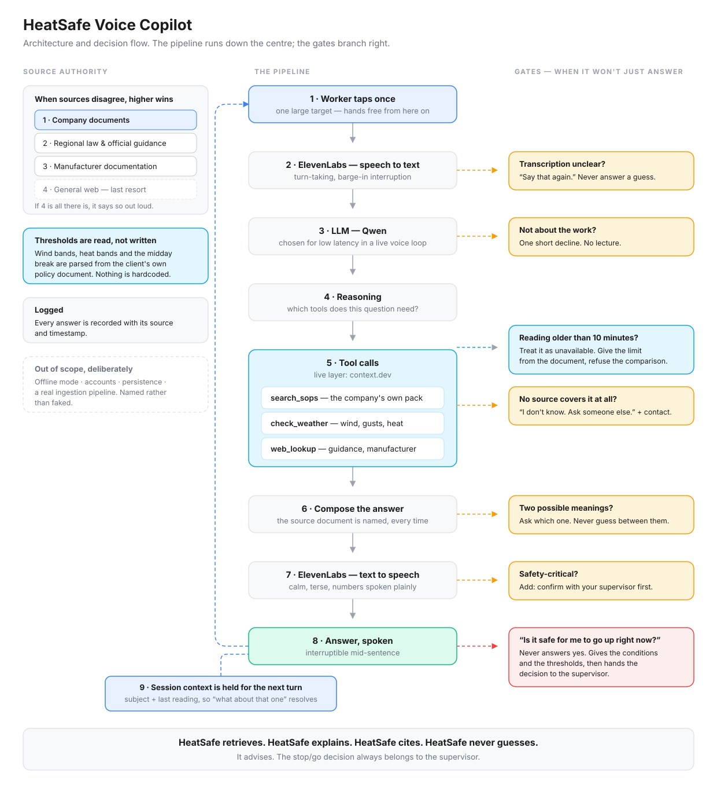

# HeatSafe Voice Copilot

HeatSafe Technologies builds voice-first operational safety copilots for
frontline teams in high-risk environments — construction, oil & gas,
utilities, ports and logistics. The engine is one and the same for every
vertical; what changes per client is a config block and a document pack
(see `agent/deployment-configs.md`).

This demo is the first deployment: construction, for a fictional client —
**Team 21**, a Dubai-based UAE contractor.

Workers and supervisors get hands-free, on-demand answers to two questions:

- **WHEN should we do this job?** — live wind and heat checked against
  Team 21's own policies.
- **HOW should I do this job?** — Team 21's procedures and checklists,
  walked through by voice.

HeatSafe doesn't simply search the internet — it understands which source has
authority: **company data > UAE regional law and official guidance >
manufacturer documentation > general web** (and if general web is the only
source, it says so out loud).

The same system compresses onboarding: new workers get answers at the point
of work instead of waiting weeks to learn the job, and the company's
knowledge stays in the company rather than in one person's head. (v2 closes
the loop: experienced workers log hazards by voice as they find them — see
TECH-SPEC extensibility.)

**HeatSafe retrieves. HeatSafe explains. HeatSafe cites. HeatSafe never
guesses.** Stop/go decisions always belong to the supervisor.

## Architecture



```
Worker voice ⇄ ElevenLabs Agent (prompt: agent/prompt.md)
                    │ webhook tools (agent/tools.md)
                    ▼
        FastAPI backend (app/)
        ├── /tools/search_sops    — BM25 retrieval over demo-data/*.md with source attribution
        ├── /tools/check_weather  — live wind/heat via context.dev vs thresholds read from the policy
        ├── /tools/web_search     — official-guidance web search via context.dev (below company data)
        ├── /tools/web_lookup     — fetch a specific guidance page via context.dev (below company data)
        ├── /api/voice-lease*     — capacity-based session slots (Redis, in-memory fallback)
        └── /analytics/learn-list — most-asked topics + questions no SOP covers (doc gaps)
```

- Team 21's company data (SOPs, wind policy, scaffold checklist) lives in
  `demo-data/` — faked for the demo, treated exactly as enterprise data.
- Wind/heat thresholds are **parsed from the policy text**, never hardcoded.
  Team 21 restricts work above 6 m from 17 mph sustained — stricter than
  commonly cited external guidance — and HeatSafe says whose rule it is
  following. Bands: normal / restricted / suspended, plus heat bands and
  the UAE summer midday break (12:30–15:00, 15 Jun–15 Sep).

## Data sources

HeatSafe fuses two groups of data, and always knows which one it is quoting.

**External / regional — retrieved live:**

| Data | Example | How it gets in |
|---|---|---|
| Weather | Temperature, humidity, forecast | context.dev `/web/extract`, refreshed every 120 s; readings report their age, anything older than the 10-min staleness budget is treated as unavailable |
| Wind | Sustained speed, gusts | same reading — Open-Meteo primary (publishes gusts), wttr.in fallback; the answer names the source used |
| Environmental conditions | Dust/shamal visibility, UV | assessed via the same live reading + policy rules |
| Regional law | UAE federal / emirate requirements (MOHRE) | context.dev `/web/scrape/markdown` on demand |
| Official HSE guidance | Government safety publications | context.dev `/web/scrape/markdown` on demand |
| Manufacturer information | Equipment specs, safety notices | context.dev `/web/scrape/markdown` on demand |

**Company (private, per client) — the BYO-documentation layer:**

| Data | Example in this demo |
|---|---|
| Company SOPs | MER-SOP-014 Working at Height |
| Safety policies | MER-SOP-021 Adverse Weather and Work Sequencing |
| Checklists | MER-SC-003 Scaffold Inspection Checklist |
| Site rules | Site-specific restrictions inside the SOPs |
| Emergency procedures | Escalation tables (radio channel 2, 800-4400) |
| Equipment procedures | Harness rules in MER-SOP-014; tool inspection and colour-tagging in MER-SOP-008 |

When the two groups disagree, company data wins, and HeatSafe says so aloud.
Company data is fictional demo data here, but is treated exactly as
enterprise data — private, authoritative, and pluggable per client.

## Run it

Requires [uv](https://docs.astral.sh/uv/) and Python 3.11+.

```bash
cp .env.example .env      # add your CONTEXT_DEV_API_KEY
uv sync
set -a; source .env; set +a
make run                  # serves on :8000
```

Check: `curl localhost:8000/health` → `{"ok":true,"sop_docs":4,"policy_loaded":true}`

## Run the evals

```bash
make eval
```

37 deterministic cases: the eval spec (section B) plus regression tests for
retrieval quality, weather staleness/fallback, the learn list and the voice
lease pool. A quarter of them verify refusal/deferral behaviour — in a
work-at-height domain, that is the product.

## ElevenLabs agent setup

1. Create an agent at elevenlabs.io/app/agents.
2. Paste `agent/prompt.md` as the system prompt.
3. Add the webhook tools from `agent/tools.md`, pointing at the deployed
   backend URL (HTTPS).
4. Put the agent id into `static/test.js` (or pass it as `/test?agent=...`)
   and open `/test` for the voice screen; `/` is the promo page.

## Spec-driven development

Built with [spec-kit](https://github.com/github/spec-kit):
- Project constitution: `.specify/memory/constitution.md`
- Feature spec: `specs/001-site-voice-assistant/spec.md`

## Known real-world requirements not built (by design)

Offline mode, user accounts, real SOP ingestion pipeline, persistence —
out of scope for the demo, listed in the spec. (Multilingual behaviour is
prompt-level: the agent answers in the worker's language; safety-critical
phrasings are pinned per language in `agent/prompt.md`.)

## Deployment (demo)

Deployed at `https://13.143.65.45.sslip.io` — FastAPI behind Caddy
(automatic Let's Encrypt TLS via sslip.io), managed by systemd
(`heatsafe.service`); secrets in `/etc/heatsafe.env` on the VPS.
