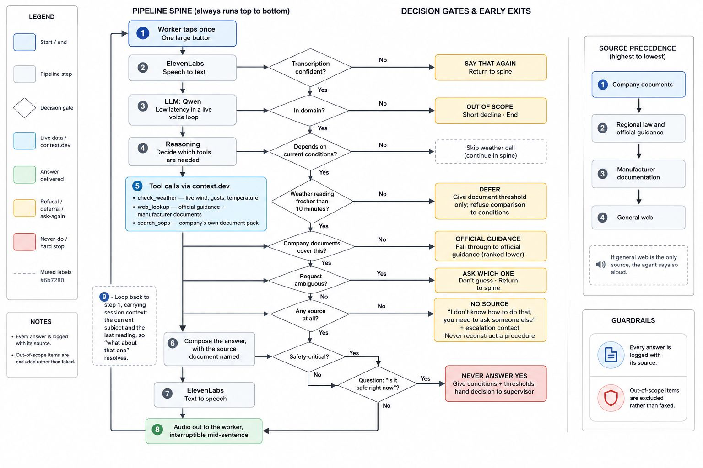

# HeatSafe Voice Copilot

HeatSafe Technologies builds voice-first operational safety copilots for
frontline teams in high-risk environments — construction, oil & gas,
utilities, ports and logistics. The engine is one and the same for every
vertical; what changes per client is a config block and a document pack
(see `agent/deployment-configs.md`).

This demo is the first deployment: construction, for a fictional client —
**Team 21**, a Dubai-based UAE contractor.

Workers and supervisors get hands-free, on-demand answers to two questions:

- **WHEN should we do this job?** — live wind and heat checked against
  Team 21's own policies.
- **HOW should I do this job?** — Team 21's procedures and checklists,
  walked through by voice.

HeatSafe doesn't simply search the internet — it understands which source has
authority: **company data > UAE regional law and official guidance >
manufacturer documentation > general web** (and if general web is the only
source, it says so out loud).

The same system compresses onboarding: new workers get answers at the point
of work instead of waiting weeks to learn the job, and the company's
knowledge stays in the company rather than in one person's head. (v2 closes
the loop: experienced workers log hazards by voice as they find them — see
TECH-SPEC extensibility.)

**HeatSafe retrieves. HeatSafe explains. HeatSafe cites. HeatSafe never
guesses.** Stop/go decisions always belong to the supervisor.

## Architecture



```
Worker voice ⇄ ElevenLabs Agent (prompt: agent/prompt.md)
                    │ four webhook tools + language_detection (agent/tools.md)
                    ▼
        FastAPI backend (app/)
        ├── /tools/search_sops    — BM25 over stemmed tokens across demo-data/*.md, source
        │                           attribution per chunk, coverage gate returns nothing
        │                           rather than a weak match
        ├── /tools/check_weather  — live wind/heat via context.dev, served from a 120s warm
        │                           snapshot, vs thresholds parsed from the policy
        ├── /tools/web_search     — context.dev /web/search, official hostnames ranked first
        │                           (below company data). The step before any refusal
        ├── /tools/web_lookup     — fetch a specific guidance page via context.dev (below company data)
        ├── /api/voice-lease*     — capacity-based session slots (Redis, in-memory fallback)
        └── /analytics/learn-list — most-asked topics + questions no SOP covers (doc gaps)
```

- Team 21's company data (SOPs, wind policy, scaffold checklist) lives in
  `demo-data/` — faked for the demo, treated exactly as enterprise data.
- Wind/heat thresholds are **parsed from the policy text**, never hardcoded.
  Team 21 restricts work above 6 m from 17 mph sustained — stricter than
  commonly cited external guidance — and HeatSafe says whose rule it is
  following. Bands: normal / restricted / suspended, plus heat bands and
  the UAE summer midday break (12:30–15:00, 15 Jun–15 Sep).
- The go/no-go verdict in `app/verdict.py` enforces four of the policy's
  rules against the live reading: the wind bands (sustained and gusts), the
  heat bands, the sheet-and-panel rule (stops at 15 mph sustained at any
  height) and the midday break, with the most restrictive applicable rule
  winning. The policy's other rules, including the sandstorm visibility
  limits, are retrieved and quoted by `search_sops` rather than computed,
  because the live reading does not carry visibility.

## Data sources

HeatSafe fuses two groups of data, and always knows which one it is quoting.

**External / regional — retrieved live:**

| Data | Example | How it gets in |
|---|---|---|
| Weather | Air temperature | context.dev `/web/extract` into a typed schema, refreshed every 120 s; readings report their age, anything older than the 10-min staleness budget is treated as unavailable |
| Wind | Sustained speed, gusts | same reading. Open-Meteo is primary because it publishes gusts and the policy makes gusts a threshold in their own right; wttr.in is the fallback and covers ad-hoc locations. The answer names the source used |
| Finding a source | Regulator, HSE or manufacturer page | context.dev `/web/search`, localised to the site country, official hostnames ranked first. Called as soon as company documents come up empty, before any refusal |
| Reading a source | UAE requirements (MOHRE), official HSE publications, manufacturer documentation | context.dev `/web/scrape/markdown` on demand, flagged aloud as not company policy |

**Company (private, per client) — the BYO-documentation layer:**

| Data | Example in this demo |
|---|---|
| Company SOPs | MER-SOP-014 Working at Height |
| Safety policies | MER-SOP-021 Adverse Weather and Work Sequencing |
| Checklists | MER-SC-003 Scaffold Inspection Checklist |
| Site rules | Site-specific restrictions inside the SOPs |
| Emergency procedures | Escalation tables (radio channel 2, 800-4400) |
| Equipment procedures | Harness rules in MER-SOP-014; tool inspection and colour-tagging in MER-SOP-008 |

When the two groups disagree, company data wins, and HeatSafe says so aloud.
Company data is fictional demo data here, but is treated exactly as
enterprise data — private, authoritative, and pluggable per client.

## Run it

Requires [uv](https://docs.astral.sh/uv/) and Python 3.11+.

```bash
cp .env.example .env      # add your CONTEXT_DEV_API_KEY
uv sync
set -a; source .env; set +a
make run                  # serves on :8000
```

Check: `curl localhost:8000/health` → `{"ok":true,"sop_docs":4,"policy_loaded":true}`

`policy_loaded` is the one to watch. It goes false if the thresholds stop
parsing out of the policy document, which is a silent failure otherwise.

### Configuration

Only `CONTEXT_DEV_API_KEY` is required. Everything else has a working default.

| Variable | Default | What it does |
|---|---|---|
| `CONTEXT_DEV_API_KEY` | — | Required for the live tools. The evals do not need it |
| `SITE_LOCATION` | `Dubai Marina` | Site name used for weather lookups |
| `SITE_LAT` / `SITE_LON` | `25.080` / `55.140` | Coordinates for the primary weather source |
| `SEARCH_COUNTRY` | `ae` | Localises `web_search` results |
| `WEATHER_REFRESH_INTERVAL` | `120` | Seconds between background weather refreshes |
| `WEATHER_STALE_AFTER` | `600` | Seconds before a reading is treated as unavailable |
| `VOICE_MAX_SESSIONS` | `3` | Concurrent voice sessions allowed (set to 1 for a demo) |
| `VOICE_LEASE_TTL` | `45` | Seconds before a silent session's slot is reclaimed |
| `REDIS_URL` | `redis://127.0.0.1:6379/0` | Lease store. Falls back to in-memory if unreachable |
| `DEMO_DATA_DIR` | `demo-data/` | The document pack to load |
| `ASK_LOG_PATH` | unset | JSONL path if the learn list should survive restarts |

## Run the evals

```bash
make eval
```

37 deterministic cases: the eval spec (section B) plus regression tests for
retrieval quality, weather staleness and fallback, the learn list and the
voice lease pool. They run offline on a clean machine, with no API key and no
network: weather readings are injected as fixtures and context.dev is
monkeypatched. Nine of the 37 cover refusal, deferral, degraded sources and
stale readings. In a work-at-height domain, that is the product.

`make lint` runs ruff over `app` and `tests`.

## ElevenLabs agent setup

1. Create an agent at elevenlabs.io/app/agents.
2. Paste `agent/prompt.md` as the system prompt.
3. Add the four webhook tools from `agent/tools.md`, pointing at the deployed
   backend URL (HTTPS). Ready-to-paste JSON definitions are in that file.
4. Add the `language_detection` system tool (Add tool → System → Language
   detection) and set the additional languages on the Agent tab. The crew is
   multilingual; the prompt pins the refusal and deferral lines per language.
5. Put the agent id into `static/test.js` (or pass it as `/test?agent=...`)
   and open `/test` for the voice screen; `/` is the promo page.

## Spec-driven development

Built with [spec-kit](https://github.com/github/spec-kit). The spec artifacts
were committed before the features they describe, so each task could be
briefed as a delta against a written standard:

- Project constitution: `.specify/memory/constitution.md`
- Feature spec: `specs/001-site-voice-assistant/spec.md`
- Turn-by-turn user flows, including the refusal and deferral paths:
  `specs/001-site-voice-assistant/user-flows.md`
- How the tools were steered, brief by brief, including the two briefs that
  went wrong: `docs/devin-log.md`
- What we verified rather than assumed, including the weather-source defect
  and the retrieval failure that produced silence instead of an error:
  `docs/FINDINGS.md`, with the source register in `docs/DATA-SOURCES.md`

## Known real-world requirements not built (by design)

Offline mode, user accounts, real SOP ingestion pipeline, persistence —
out of scope for the demo, listed in the spec. (Multilingual behaviour is
prompt-level: the agent answers in the worker's language; safety-critical
phrasings are pinned per language in `agent/prompt.md`.)

## Deployment (demo)

Deployed at
`https://royalty-mathematical-engineers-improvement.trycloudflare.com` —
FastAPI on the VPS, exposed through a Cloudflare quick tunnel, managed by
systemd (`heatsafe.service`); secrets in `/etc/heatsafe.env` on the VPS.

That is a **quick tunnel**, so the hostname is ephemeral and only guaranteed
for the demo window. If it does not answer, run the backend locally with the
steps above; nothing in the product depends on that host. The tool URLs in
`agent/tools.md` and the deployment URL in `static/test.js` both need updating
if the tunnel is replaced.

`/flow` serves the architecture and decision-flow diagram, because GitHub
renders `docs/architecture-flow.html` as source rather than as a page.
