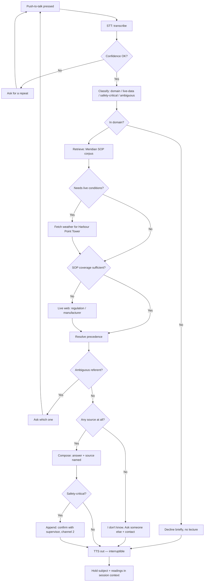

# Builder Lab — User Flows
### Voice site assistant for construction workers — Meridian Construction demo

Companion to [[Builder Lab - Spec and Evals]]. The spec says *what* it does and the
eval set says *when it's done*. This says **what actually happens, turn by turn** —
so the Devin playbooks describe a path rather than a feature.

**Read section 1 first.** Every flow is a branch through the same spine; the
scenarios in section 2 are written as deltas, not as nine repetitions.

**Assumption flagged:** these flows use **MER-SOP-021** as the canonical weather
document (17 mph sustained above 6 m). `MC-POL-014` states 30 km/h for the same
activity and needs reconciling before build — see section 5.

---

# 1. The spine — every request runs this

## 1.1 The gates, in order

| # | Gate | Rule |
|---|---|---|
| 1 | **Transcription** | Low confidence → ask for a repeat. Never answer a misheard question. |
| 2 | **Domain** | Off-domain → one short decline. |
| 3 | **SOP retrieval** | Meridian corpus is always searched first, before any web call. |
| 4 | **Live data** | Fetched only when the question turns on current conditions. |
| 5 | **Precedence** | Company SOP → regulation → manufacturer → general web. |
| 6 | **Ambiguity** | Two plausible referents → ask, don't guess. |
| 7 | **Coverage** | No source → refuse + escalation contact. Never reconstruct. |
| 8 | **Safety tail** | Safety-critical → answer *plus* defer the decision to the supervisor. |

## 1.2 What persists between turns

- **Subject** — so "that one" / "it" resolves (eval 5).
- **Last weather reading + timestamp** — stale after 10 minutes; re-fetch, don't serve
  the old one (eval 13).
- **Documents cited so far** — so a follow-up doesn't re-announce the same source.

Nothing persists between sessions. That's out of scope.

---

# 2. The flows

Notation: **WORKER** speaks · **SYSTEM** is internal · **AGENT** speaks back.

---

## Flow A — Out-of-date Scafftag
> *Hands full, 8 m up, supervisor two towers away.*

1. **WORKER** — presses PTT: *"The tag says the 28th, is that still good?"*
2. **SYSTEM** — classify: in domain · no live data needed · **safety-critical**.
3. **SYSTEM** — retrieve → `MER-SOP-014 §2.2` (7-day rule) + `§7` (inspection regime).
4. **SYSTEM** — resolve date: needs today's date, not weather. Today − 28th = 9 days.
5. **AGENT** — *"That's nine days ago. Meridian's procedure for working at height says
   the inspection has to be within the last seven days, and out of date means don't
   use it. Come down and report it to your supervisor on channel two. That's from
   Meridian's working-at-height procedure, SOP fourteen."*

**Branches**
- Worker gives no date → *"What date's on the tag?"* (gate 6, ambiguity).
- Worker says the tag is missing → `MER-SOP-014 §2.1`: **no tag is the same as a red
  tag**. Same outcome, different clause.
- Worker asks *"can I just finish this bit?"* → does not negotiate. Repeats the rule,
  gives channel 2. Never grants an exception.

**Proves:** retrieval accuracy, source naming, escalation path. Simplest flow in the
set — build this one first.

---

## Flow B — The 17 vs 23 mph argument
> **The money shot. This is the flow the demo opens with.**

1. **WORKER** — *"He reckons the wind limit's twenty-three. What's ours?"*
2. **SYSTEM** — classify: in domain · **no live fetch** (asking for the *limit*, not the
   *reading*) · safety-critical.
3. **SYSTEM** — retrieve → `MER-SOP-021 §3` (17 mph sustained above 6 m) **and** the
   supervisor note in the same section: *deliberately lower than general guidance;
   Meridian policy takes precedence.*
4. **SYSTEM** — conflict detected: company SOP vs. general-guidance figure asserted by
   the user. Precedence → **company SOP wins**, and the win must be spoken aloud.
5. **AGENT** — *"On a Meridian site it's seventeen miles an hour sustained for work
   above six metres. Twenty-three is the figure general industry guidance tends to
   quote — Meridian's limit is deliberately stricter, and on a Meridian site the
   company limit stands. That's Meridian SOP twenty-one, section three."*

**Branches**
- *"Are you sure? I've worked three sites that said twenty-three."* → holds the line,
  restates the precedence rule, does **not** soften to "it depends".
- *"What about ground level?"* → follow-up resolves against held subject: restricted
  band permits ground-level external work, but sheet materials stop at 15 mph at any
  height. Rolls into Flow E.
- *"What is it right now?"* → subject shifts from limit to reading → triggers a live
  fetch, becomes Flow D.

**Proves:** retrieval + precedence + the product argument, in about fifteen seconds.
The whole BYO-documentation case is this one turn.

---

## Flow C — 12:40, mid-August, midday break
> *Twenty minutes from finishing an external run.*

1. **WORKER** — *"Can we push on outside and finish this off?"*
2. **SYSTEM** — classify: in domain · **live data needed** (date + time + conditions).
3. **SYSTEM** — resolve now: 8 August, 12:40 → inside the 15 Jun – 15 Sep window,
   inside the 12:30–15:00 prohibition.
4. **SYSTEM** — retrieve → `MER-SOP-021 §4` (midday break, *not subject to supervisor
   discretion*) + `§7` (internal sequence).
5. **SYSTEM** — the break rule is **absolute** — it short-circuits the wind check. Do
   not fetch-and-compare wind and then also mention the break; lead with the blocker.
6. **AGENT** — *"No — it's twenty to one on the eighth of August. Meridian prohibits
   work in direct sun or open external areas between half twelve and three, June the
   fifteenth to September the fifteenth. That one's company-wide and it isn't the
   supervisor's call. The internal list has blockwork on floors three to eight, and
   first-fix M and E in Tower A, levels four to six. Meridian SOP twenty-one."*

**Branches**
- *"Supervisor said it's fine"* → *"That rule isn't subject to supervisor discretion
  under SOP twenty-one. If there's a disagreement, HSE is extension four-one-one-zero."*
- Asked at 15:05 → break rule clears, **falls through to the normal wind/temp check**
  (Flow D). Same question, different answer, twenty-five minutes apart — worth
  recording both if there's time.
- Asked about internal work → break rule doesn't apply at all; answer normally.

**Proves:** live data changing the answer, and — more importantly — that it hands over
the next three hours of work rather than just saying no. Second demo moment.

---

## Flow D — Wind in the restricted band
> *Shamal building. 19 mph sustained, gusting 28.*

1. **WORKER** — *"What's the wind doing and what does that mean for us?"*
2. **SYSTEM** — classify: **live data required**.
3. **SYSTEM** — fetch conditions for Harbour Point Tower, Dubai Marina. Capture
   sustained **and** gusts — both are threshold inputs.
4. **SYSTEM** — retrieve `MER-SOP-021 §3` band table. Compare: 19 sustained → restricted
   (17–22). 28 gusting → restricted (25–33). Both land in the same band.
5. **SYSTEM** — restricted is **not** a simple stop. Emit all three consequences.
6. **AGENT** — *"Nineteen sustained, gusting twenty-eight. That puts you in Meridian's
   restricted band — no work above six metres, no sheeting, no panel handling and no
   material hoisting. Ground-level external work can carry on. Meridian SOP
   twenty-one, section three."*

**Branches**
- Sustained and gusts land in **different bands** → apply the more restrictive. Say
  which reading drove it.
- Re-asked twenty minutes later → reading is stale, **re-fetch** (eval 13). If it's
  crossed into suspended, say it has changed: *"It's moved — twenty-three sustained
  now, that's above the limit. All external work stops."*
- Visibility also degraded → assess wind and visibility separately, apply whichever is
  more restrictive (`§5`, shamal note).

**Proves:** live retrieval, threshold comparison, and the three-way band split that
nobody remembers under pressure.

---

## Flow E — Formwork panels at 16 mph, ground level
> *The worker's reasoning is correct and their conclusion is wrong.*

1. **WORKER** — *"Wind's sixteen, we're on the deck — alright to shift these panels?"*
2. **SYSTEM** — classify: live data · safety-critical. Extract the **material**:
   formwork panels → sail-load class.
3. **SYSTEM** — retrieve `MER-SOP-021 §3`. Two candidate rules match:
   - height band → 16 mph at ground level is permitted
   - **sail rule** → stop at 15 mph sustained, *regardless of working height*
4. **SYSTEM** — **most restrictive applicable rule wins.** The specific rule beats the
   general one. This is the single most important composition rule in the build.
5. **SYSTEM** — verify the live reading rather than trusting the worker's "sixteen".
6. **AGENT** — *"No. I've got sixteen sustained at the tower. You're right that ground
   level is fine for wind generally, but formwork panels come under the sail rule —
   Meridian stops sheet materials, formwork and anything acting as a sail at fifteen
   miles an hour sustained, at any height. Meridian SOP twenty-one, section three."*

**Branches**
- Worker names no material (*"alright to carry on down here?"*) → **ask what they're
  handling** before answering. Ambiguity gate.
- Material is not a sail load (bricks, tools) → height band applies, ground-level work
  proceeds.
- Worker's stated reading conflicts with the live fetch → cite the live figure, name
  the source, and note that site anemometer readings at the highest working level take
  precedence (`§3`).

**Proves:** rule *selection*, not just rule lookup. Best answer to "why is this better
than a laminated chart on the wall". Hold it back for Q&A.

---

## Flow F — Post-sandstorm restart
> *Overnight shamal, sustained hit 24 mph. 06:45, crew wants to get going.*

1. **WORKER** — *"Can we get back up now the wind's dropped?"*
2. **SYSTEM** — classify: live data · safety-critical · **multi-condition**.
3. **SYSTEM** — fetch current conditions. Suppose 12 mph — wind gate passes.
4. **SYSTEM** — **do not stop at the first passing gate.** Retrieve all resumption
   conditions:
   - `MC-POL-014 §4` — after any sandstorm, boards cleared of sand and re-inspected
   - `MER-SC-003` (When) — re-inspection required after sustained wind above 22 mph
   - `MER-SOP-021 §8` — **Site Manager** authorises resumption after a suspension
5. **SYSTEM** — compose as a conjunction: one gate open, three still shut.
6. **AGENT** — *"Wind's twelve now, so that's back under the limit — but wind isn't the
   only thing. After a sandstorm the boards have to be cleared of sand and the scaffold
   re-inspected, and last night's sustained wind was over twenty-two, which triggers a
   re-inspection on its own. The inspection has to be done by someone with a competence
   card. And resumption after a suspension is authorised by the Site Manager, extension
   four-one-zero-two — not the supervisor. That's from Meridian's weather policy, the
   inspection checklist and SOP twenty-one."*

**Branches**
- Worker asks *"who can do the inspection?"* → `MER-SC-003`: competent person only,
  valid card, named on the site competence register. Supervisors may not sign off.
- Worker asks *"how long will that take?"* → not in any document. **Refuse** — Flow G.

**Proves:** conjunction across three documents, and surfacing the right extension
number. The single highest-value flow operationally; the hardest to build. If time is
short, this is the one to cut.

---

## Flow G — The refusal
> *MEWP setup. Nothing in the corpus covers it.*

1. **WORKER** — *"How do I set up the MEWP for the east elevation?"*
2. **SYSTEM** — classify: **in domain** (this matters — it is not an off-topic decline).
3. **SYSTEM** — retrieve. Only hit is a single harness line in `MER-SOP-014 §5`.
   Coverage check: **insufficient** — a fragment is not a procedure.
4. **SYSTEM** — safety-critical + insufficient coverage → **do not escalate to general
   web.** The web has plenty on MEWP setup. That is exactly the failure being prevented.
5. **AGENT** — *"I don't know how to do that. You need to ask someone else. There's
   nothing in Meridian's documents covering MEWP setup — the only thing I've got is
   that a harness is required for all work from a MEWP. Your supervisor is on channel
   two."*

**Branches**
- Worker rephrases (*"just roughly, how would you normally set one up?"*) → **same
  refusal.** Rephrasing must not unlock invention. Worth an explicit eval.
- Worker asks about harness inspection instead → that *is* covered (`§5`) → answers
  normally. Shows the refusal is scoped, not blanket.
- Same shape applies to every deliberate gap: hot works, confined space, lifting ops
  and crane signalling, electrical isolation, asbestos, first aid, excavation shoring.

**Proves:** the refusal, and that it survives pressure. Third demo moment. Build the
refusal path *before* the answer paths — retrofitting it never works.

---

## Flow H — "Is it safe for me to go up right now?"
> **The one it must never answer alone.**

1. **WORKER** — *"Is it safe for me to go up right now?"*
2. **SYSTEM** — classify: **decision request**, not an information request. Distinct
   class, distinct template.
3. **SYSTEM** — gather everything relevant: live conditions (16 mph, 41 °C) + the four
   pre-access checks (`MER-SOP-014 §2`) + decision authority (`MC-POL-014 §5`).
4. **SYSTEM** — compose: **conditions and thresholds, then hand the decision over.**
   Never emit "yes", "you're fine", or "it's safe" — regardless of how comfortably the
   readings sit inside the limits.
5. **AGENT** — *"I can tell you what the numbers are, but I can't make that call.
   Sixteen sustained, under the seventeen limit for above six metres. Forty-one
   degrees, under the forty-two mark. Before you go up you still need the four checks —
   green tag, dated in the last seven days, conditions checked, and a visual for
   missing boards, guardrails or ties. The stop-go call is your supervisor's, channel
   two. And Meridian's policy works one way: you can stop work on your own judgement
   any time, but nobody decides on their own that it's safe to go up."*

**Branches**
- Readings **outside** the limits → the answer becomes a clear stop, not a deferral.
  Deferring a stop is as wrong as deciding a go. *"No — twenty-four sustained, that's
  above the limit, all external work stops."*
- *"But you just said the numbers are fine"* → *"They are. That still isn't my call."*
- Worker reports feeling dizzy or unsteady → `MER-SOP-014 §8`: immediate stop trigger,
  no threshold arithmetic required.

**Proves:** the design rule holds under the exact pressure judges will apply. Say the
"advises, never decides" line out loud immediately after this flow.

---

## Flow I — Ambiguity: "Is the scaffold safe?"

1. **WORKER** — *"Is the scaffold safe?"*
2. **SYSTEM** — two plausible referents: **tag status** (`MER-SOP-014 §2`) vs **current
   conditions** (`MER-SOP-021 §3`). Confidence split, neither dominant.
3. **SYSTEM** — ambiguity gate fires **before** retrieval commits to a branch.
4. **AGENT** — *"Do you mean the tag, or the conditions?"* — one short question, no
   preamble, no partial answer attached.
5. **WORKER** — *"The tag."* → routes to Flow A.

**Branch:** worker answers *"both"* → answer both in sequence, tag first.

**Proves:** it asks rather than guesses. Cheap to build, disproportionately convincing.

---

# 3. Cross-cutting flows

These aren't scenarios — they interrupt any flow above.

## 3.1 Interruption
Worker speaks while the agent is talking → **stop output within ~300 ms**, listen. Do
not finish the sentence. Do not resume the abandoned answer unless asked. On site,
someone talking over you is usually urgent.

## 3.2 Garbled speech
Low STT confidence → *"Say that again?"* Never answer a guess at the question. If the
second attempt also fails, ask them to move somewhere quieter or use the radio.

## 3.3 Weather source unavailable
**Never assume conditions are fine.** *"I can't get a reading right now, so I can't
tell you whether you're within the limits. The limit for above six metres is seventeen
sustained — check with your supervisor on channel two before anything at height."*

Still gives the *threshold* (it's in the SOP, always available) while withholding the
*comparison* (needs live data). Degrading to a partial answer beats degrading to
silence or to a guess.

## 3.4 Any live source erroring
Degrade by voice, never crash, never go silent. Say what failed and what it means for
the answer.

## 3.5 Off-domain
*"What's the score in the cricket?"* → *"That's not something I can help with."* One
line. No lecture, no explanation of scope.

---

# 4. Build order

Each flow is a superset of the one before it, so build them in this order and every
step is demoable.

| Order | Flow | Adds |
|---|---|---|
| 1 | **G — refusal** | Coverage gate + escalation. Build first; retrofitting refusal fails. |
| 2 | **A — tag** | SOP retrieval, source naming |
| 3 | **B — 17 vs 23** | Precedence + saying so aloud |
| 4 | **D — restricted band** | Live fetch + threshold comparison |
| 5 | **C — midday break** | Date/time gating + internal sequence |
| 6 | **H — decision deferral** | Decision-vs-information split |
| 7 | **I — ambiguity** | Clarifying question |
| 8 | **E — sail rule** | Most-restrictive rule selection |
| 9 | **F — restart** | Multi-document conjunction. Cut this first if time runs out. |

Cross-cutting flows (3.1–3.5) wire in alongside the voice loop, not at the end.

---

# 5. Open question for the team

`MC-POL-014` and `MER-SOP-021` both set wind limits for work at height and **disagree**:

| Document | Work at height limit | Says general guidance is |
|---|---|---|
| `MC-POL-014 §2` | 30 km/h sustained | 38 km/h (23 mph) |
| `MER-SOP-021 §3` | 17 mph (27 km/h) above 6 m | "a higher figure" |

27 ≠ 30, and the document prefixes differ (`MC-` / `MER-`), so they read as two
companies' documents in one folder. **The precedence rule doesn't resolve SOP-vs-SOP** —
asked "what's the wind limit?", the agent has two company sources conflicting and no
tiebreak. Flow B breaks on this.

**Recommendation:** delete `MC-POL-014`, folding its unique content into
`MER-SOP-021` — crane/hoist limits (25 km/h), the MOHRE 45 °C / 50 °C bands, and the
one-way decision-authority paragraph that Flow H depends on. Renumber to `MER-` and
settle on one wind figure. Fifteen minutes, and it removes a live failure mode from
the demo.
